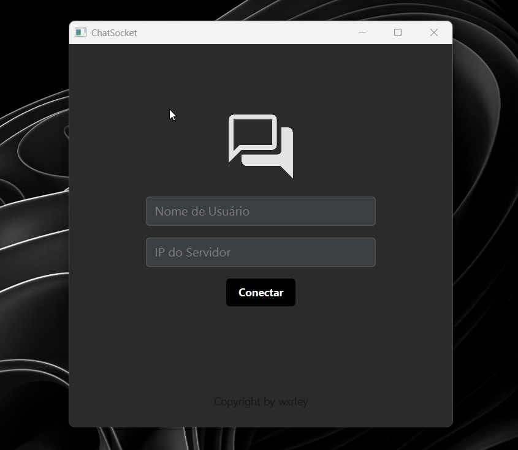
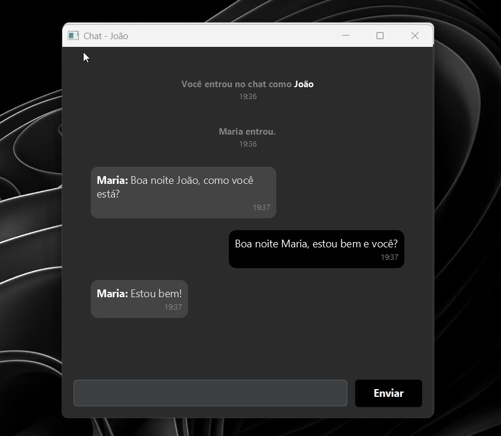
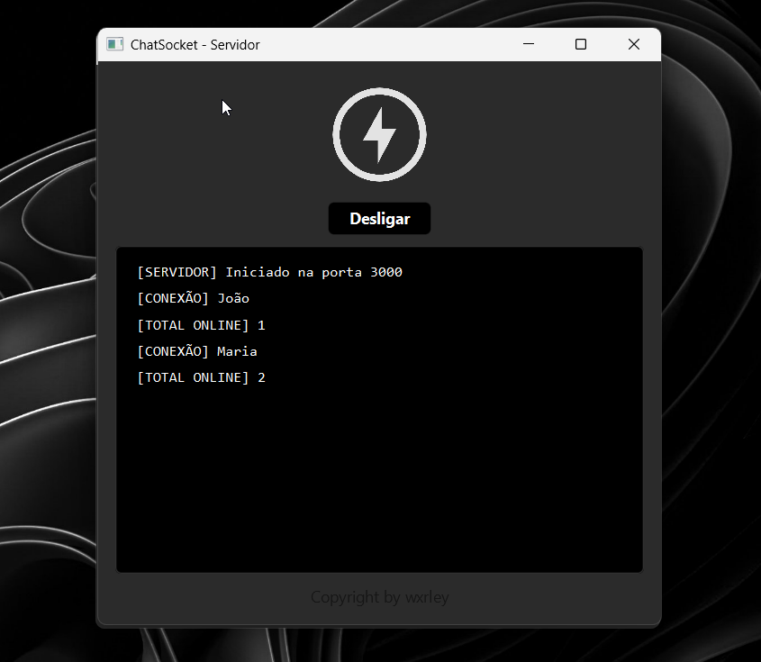
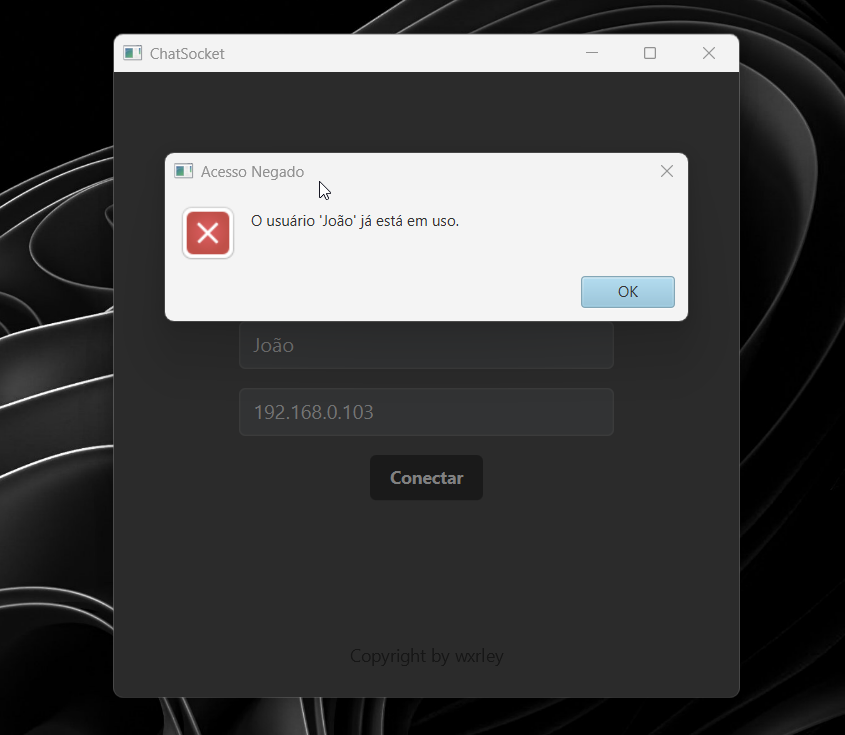

# 💬 ChatSocket ☕
Uma aplicação desktop de comunicação em tempo real, moderna e distribuída com **reconexão automática** e interface rica em JavaFX.

## 💡 Sobre o projeto
Este projeto foi desenvolvido para demonstrar o potencial da comunicação via **Sockets TCP/IP** combinada com interfaces modernas em **JavaFX**. \
O **ChatSocket** é uma aplicação de chat cliente-servidor que utiliza **Virtual Threads (Java 21)** para gerenciar múltiplas conexões simultâneas com alta performance. O sistema conta com **reconexão automática**, validação de usuários, feedback visual de status de conexão e uma interface customizada que diferencia automaticamente mensagens do usuário, outros participantes e notificações do sistema.

## ⚙️ Funcionalidades
- **Comunicação Instantânea:** Troca de mensagens em tempo real via protocolo TCP.
- **Reconexão Automática:** Detecta queda do servidor e tenta reconectar automaticamente (até 10 tentativas).
- **Servidor Concorrente:** Gerenciamento de múltiplos clientes simultâneos usando **Virtual Threads** (Project Loom).
- **Validação de Usuário:** Impede conexões com nomes de usuário duplicados.
- **Interface Customizada:** Bolhas de chat diferenciadas para mensagens próprias, de outros usuários e do sistema.
- **Validação de IP:** Validação rigorosa de endereços IPv4 usando Regex.
- **Feedback Visual:** Notificações automáticas de entrada/saída de usuários e status de conexão.
- **Thread-Safety:** Uso de `ConcurrentHashMap`, `volatile` e `synchronized` para operações seguras.
- **Deploy Portátil:** Scripts `.bat` para execução imediata sem IDE.
- **CSS Customizável:** Interface dark theme com scrollbar otimizada e estilos modernos.

## 🧩 Tecnologias Utilizadas
- Java 21
- JavaFX 21
- Maven
- Sockets TCP/IP
- ObjectInputStream/ObjectOutputStream
- CSS

## 🛠️ Instalação
**1.** Verifique se o **Java 21** e o **Maven** estão instalados:
> Para confirmar, execute no terminal:
> ```bash
> java -version
> mvn -version
> ```
> Caso precise, baixe o [JDK 21](https://www.oracle.com/java/technologies/downloads/#java21) ou [Maven](https://maven.apache.org/download.cgi).

**2.** Baixe ou clone este repositório:
> ```bash
> git clone https://github.com/wxrley/ChatSocket.git
> ```

## 🚀 Execução
> [!NOTE]
> **Conexão entre Redes Distantes** \
> Para conectar com amigos fora da sua rede local (WiFi), é necessário utilizar uma **VPN** como [Radmin VPN](https://www.radmin-vpn.com/br/) ou [Hamachi](https://www.vpn.net/).
>
> **Como funciona:** \
> **1.** Todos os participantes entram na **mesma rede VPN**. \
> **2.** O **Servidor** informa seu **IP da VPN** aos clientes. \
> **3.** Os **Clientes** usam esse IP na tela de login para se conectarem.

#### Opção 1 — Via Terminal (Maven)
**1.** Entre na raiz do projeto e execute o comando para iniciar o Servidor:
> ```bash
> mvn compile exec:java "-Dexec.mainClass=com.wxrley.server.ServerFXMain"
> ```
> O servidor abrirá uma janela. Clique no botão **"Ligar"**.

**2.** Em outro terminal, execute o Cliente:
> ```bash
> mvn compile exec:java "-Dexec.mainClass=com.wxrley.client.ClientFXMain"
> ```
> Digite o **Nome de Usuário** e o **IP do servidor**.

#### Opção 2 — Via IDE (IntelliJ, Eclipse, VS Code, etc.)
**1.** Abra a pasta do projeto na sua IDE preferida. \
**2.** Abra o arquivo `ServerFXMain.java` e clique em **Run** para iniciar o servidor. \
**3.** Clique no botão **"Ligar"**. \
**4.** Em seguida, abra o arquivo `ClientFXMain.java` e execute também com **Run** para iniciar o cliente. \
**5.** Digite o **Nome de Usuário** e o **IP do servidor**.

#### Opção 3 — Via Build Pronta (Sem Código Fonte)
**Servidor:** \
**1.** Navegue até 📂`releases/ChatServer/`. \
**2.** Execute o arquivo `init.bat`. \
**3.** Clique no botão **"Ligar"**.

**Cliente:** \
**1.** Navegue até 📂`releases/ChatClient/`. \
**2.** Execute o arquivo `init.bat`. \
**3.** Digite seu nome e o IP do servidor. \
**4.** Clique em **"Conectar"**.
> [!TIP]
> Você pode copiar a pasta `ChatClient/` para outras máquinas e todos se conectarão ao mesmo servidor. \
> **Ideal para distribuir para amigos ou testar rapidamente**. \
> Não precisa instalar Maven ou IDE.

## 🧪 Como Usar
#### 1. Iniciando uma Conversa
- Inicie o **Servidor**.
- Inicie o **Cliente**.
- Cada cliente digita: **Nome:** (único) e **IP:** (ex: `192.168.0.10`).

#### 2. Enviando Mensagens
- Digite sua mensagem no campo de texto.
- Pressione **Enter** ou clique em **"Enviar"**.
- Para **quebrar linha** sem enviar, pressione **Shift+Enter** (o campo cresce até 3 linhas).
- Suas mensagens aparecem à **direita** (fundo preto).
- Mensagens de outros aparecem à **esquerda** (fundo cinza).
- Mensagens do sistema aparecem **centralizadas** (texto cinza).

#### 3. Reconexão Automática
- Se o servidor cair, aparece: **"Servidor desconectado."**.
- O cliente tenta reconectar automaticamente a cada 3 segundos.
- Quando reconecta, aparece: **"Servidor reconectado."**.
- Você pode continuar enviando mensagens normalmente.

#### 4. Gerenciando o Servidor
- Clique em **"Desligar"** para parar o servidor.
- Todos os clientes são notificados e tentarão reconectar.
- Clique em **"Ligar"** novamente para restaurar o serviço.
- Os logs mostram conexões, desconexões e total de usuários online.

## 🖼️ Screenshots
<table>
  <div align="center">
  <tr>
    <td></td>
    <td></td>
  </tr>
  <tr>
    <td align="center"><b>👤 Tela de login</b></td>
    <td align="center"><b>💬 Tela do chat</b></td>
  </tr>
  <tr>
    <td></td>
    <td></td>
  </tr>
  <tr>
    <td align="center"><b>🌐 Tela do servidor</b></td>
    <td align="center"><b>❌ Tela de erro</b></td>
  </tr>
  </div>
</table>

## 👨‍💻 Autor
**Wxrley** — só mais um dev latino americano 💪
